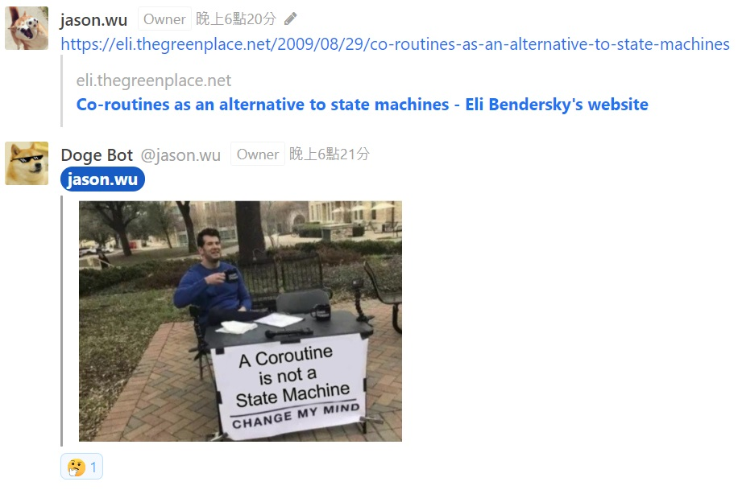

# Annoying Doge Bot

[](https://opensource.org/licenses/Apache-2.0) 

A Rocket.Chat bot that randomly reads conversations to send annoying memes.




## Getting Started

### Configuration

Edit `config/setting.yaml` to configure project.

#### Required

* `rocket_chat`
  * `url` - URL of your Rocket Chat site
  * `user_name` - Username of bot to send messages, could be a normal user
  * `password` - Password of above user
* `chat_bot`
  * `display_name` - Name of chatbot display in Rocket Chat
  * `avatar_url` - Avatar image URL of chatbot display in Rocket Chat
  * `target_channels` - List of channels name to monitor and send messages
* `google_search`
  * `url` - URL of Google Custom Search JSON API, would be one of the following:
    * `https://www.googleapis.com/customsearch/v1` for [normal API](https://developers.google.com/custom-search/v1/using_rest)
    * `https://www.googleapis.com/customsearch/v1/siterestrict` for [restricted API](https://developers.google.com/custom-search/v1/site_restricted_api)
  * `cx` - Programmable Search Engine ID, see document [here](https://developers.google.com/custom-search/v1/introduction) for more information
  * `api_key` - API key of application, see document [here](https://developers.google.com/custom-search/v1/introduction) for more information

#### Optional

* `chat_bot`
  * `alternative_rules` - Replace messages to alternative `value` to search meme if messages contain `key`
  * `pattern_matching` - Reply message `value` to target if messages contain pattern `key`
* `watch_dog`
  * `time_interval_sec` - Interval time of monitoring channel messages
  * `time_limit_sec` - Service life, end service if reach time limit

### Starting service

```bash
go build cmd/annoying-doge/main.go

# Linux or macOS
./main

# Windows
main.exe
```

## Features

WIP
